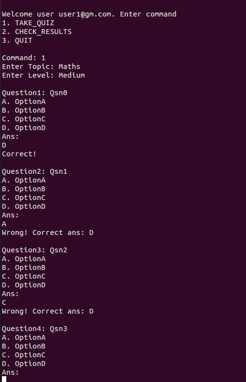
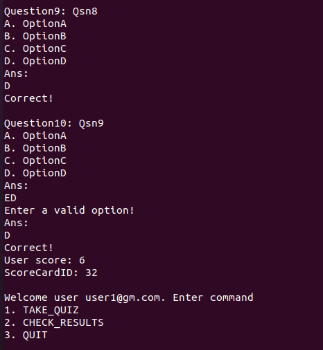
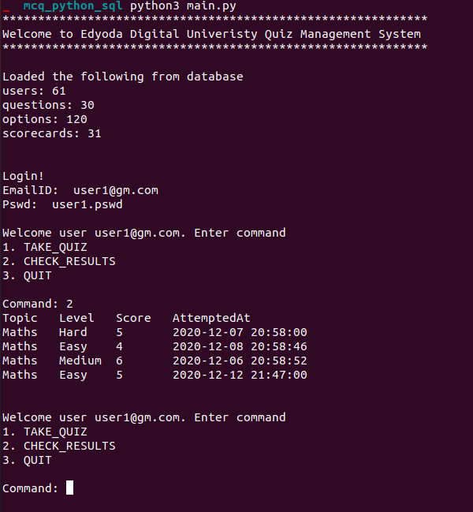
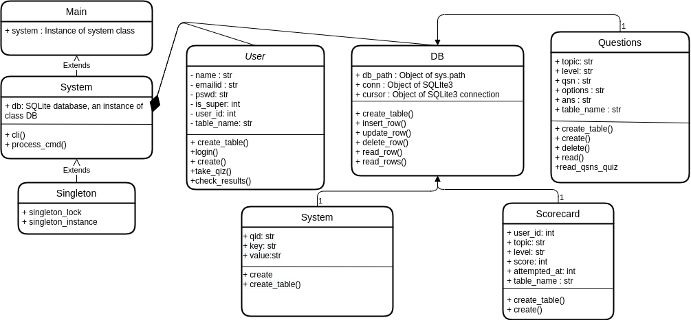

# Edyoda Quiz Management System

Multiple choice Question Quiz management system CLI App built in python with following functionalities

## Super user mode

Operations

- ADD_USER: User details will be asked in CLI
- ADD_QUESTION: Question details and MCQ options details will be asked by CLI

Both these above operations will write to an SQLite3 database

## User mode

Operations

- TAKE_QUIZ: User will be asked questions from the given topic and level
- CHECK_RESULTS: User can check results of previous attempts







## Class Diagram

Code architecture



## Development Environment

```bash
Programming Language: Python 3.8.3
Dependency Managament Tools: Pip
Interface: CLI
Preferred IDE: VS Code
```

## Development

```bash
git clone git@github.com:jhosarathy/edyoda_final_assessment
cd edyoda_final_assessment/mcq_python_sql
python3 main.py
```
